<div style="display: flex; align-items: center;">
    <a href="https://colab.research.google.com/github/fralfaro/DS-Cheat-Sheets/blob/main/docs/examples/matplotlib/matplotlib.ipynb" target="_parent">
        
    </a>
</div>

# Matplotlib


[Matplotlib](https://matplotlib.org/) is a Python 2D plotting library which produces publication-quality 
figures in a variety of hardcopy formats and interactive environments across platforms.

## Install and import Matplotlib

`
$ pip install matplotlib
`


```python
# Import matplotlib convention
import matplotlib.pyplot as plt
```

## Anatomy of a figure


In Matplotlib, a figure refers to the overall canvas or window that contains one or more individual plots or subplots. 
    Understanding the anatomy of a Matplotlib figure is crucial for creating and customizing your visualizations effectively.


```python
import numpy as np
import matplotlib.pyplot as plt

# Prepare Data
x = np.linspace(0, 2*np.pi, 100)
y = np.sin(x)

# Create Plot
fig, ax = plt.subplots()

# Plot Data
ax.plot(x, y)

# Customize Plot
ax.set_xlabel('X-axis')
ax.set_ylabel('Y-axis')
ax.set_title('Sine Function')
ax.grid(True)

# Save Plot
plt.savefig('sine_plot.png')

# Show Plot
plt.show()
```


    
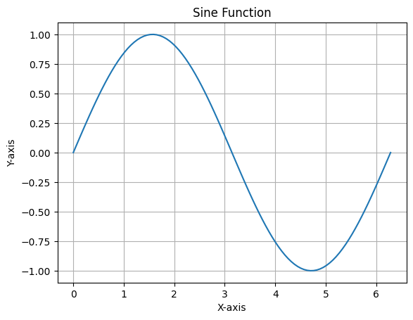
    


## Basic Plots


```python
# Create a scatter plot
X = np.random.uniform(0, 1, 100)
Y = np.random.uniform(0, 1, 100)
plt.scatter(X, Y)
plt.show()
```


    
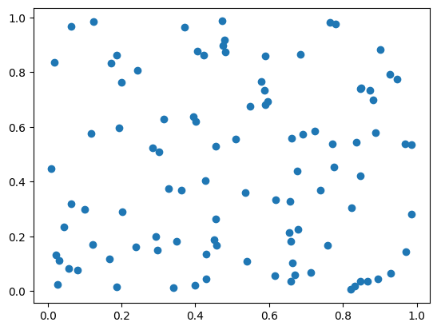
    


```python
# Create a bar plot
X = np.arange(10)
Y = np.random.uniform(1, 10, 10)
plt.bar(X, Y)
plt.show()
```


    
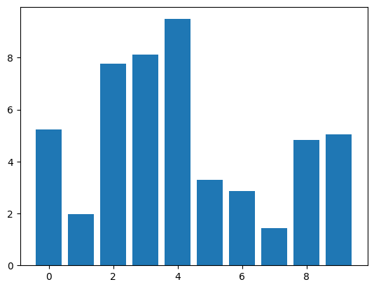
    


```python
# Create an image plot using imshow
Z = np.random.uniform(0, 1, (8, 8))
plt.imshow(Z)
plt.show()
```


    
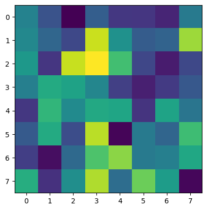
    


```python
# Create a contour plot
Z = np.random.uniform(0, 1, (8, 8))
plt.contourf(Z)
plt.show()
```


    
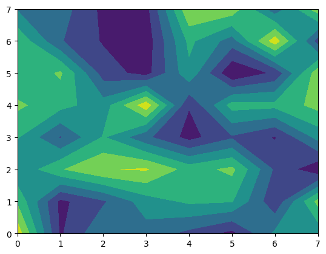
    


```python
# Create a pie chart
Z = np.random.uniform(0, 1, 4)
plt.pie(Z)
plt.show()
```


    

    


```python
# Create a histogram
Z = np.random.normal(0, 1, 100)
plt.hist(Z)
plt.show()
```


    
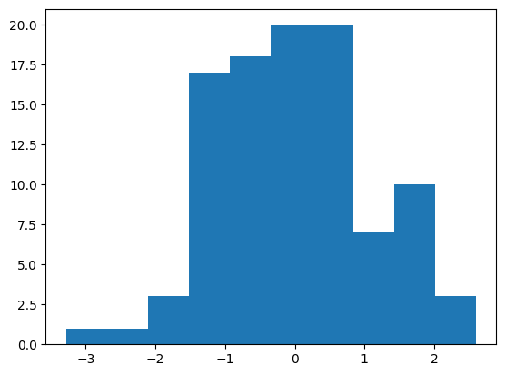
    


```python
# Create an error bar plot
X = np.arange(5)
Y = np.random.uniform(0, 1, 5)
plt.errorbar(X, Y, Y / 4)
plt.show()
```


    
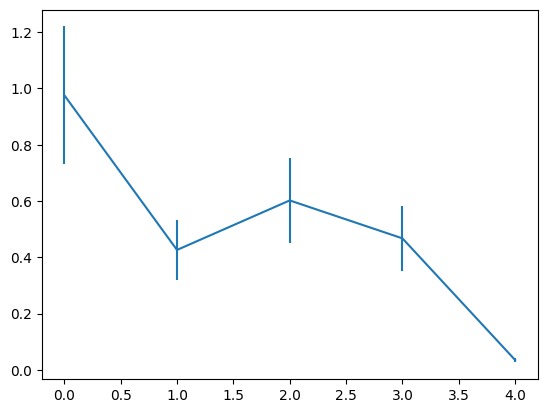
    


```python
# Create a box plot
Z = np.random.normal(0, 1, (100, 3))
plt.boxplot(Z)
plt.show()
```


    
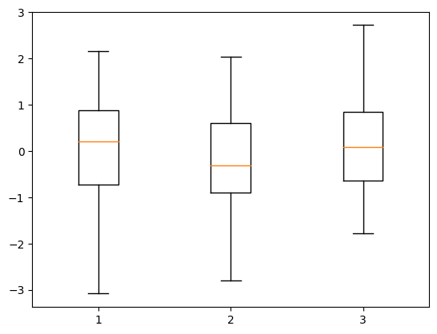
    


## Tweak


```python
# Create a plot with a black solid line
X = np.linspace(0, 10, 100)
Y = np.sin(X)
plt.plot(X, Y, color="black")
plt.show()
```


    
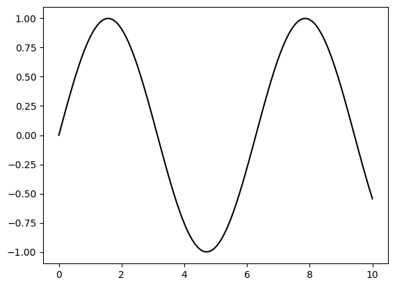
    


```python
# Create a plot with a dashed line
X = np.linspace(0, 10, 100)
Y = np.sin(X)
plt.plot(X, Y, linestyle="--")
plt.show()
```


    
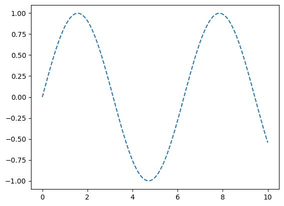
    


```python
# Create a plot with a thicker line
X = np.linspace(0, 10, 100)
Y = np.sin(X)
plt.plot(X, Y, linewidth=5)
plt.show()
```


    
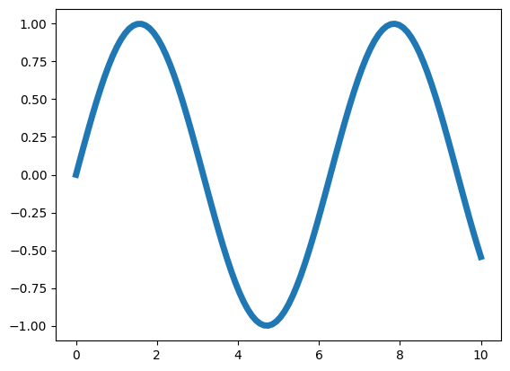
    


```python
# Create a plot with markers
X = np.linspace(0, 10, 100)
Y = np.sin(X)
plt.plot(X, Y, marker="o")
plt.show()
```


    
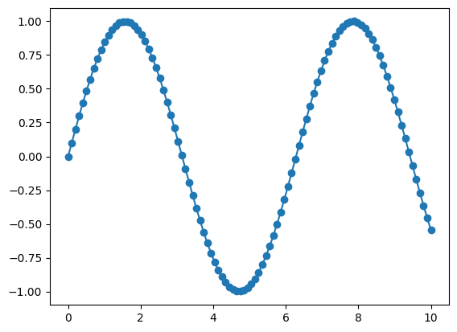
    


## Organize


```python
# Create a plot with two lines on the same axes
X = np.linspace(0, 10, 100)
Y1, Y2 = np.sin(X), np.cos(X)
plt.plot(X, Y1, X, Y2)
plt.show()
```


    
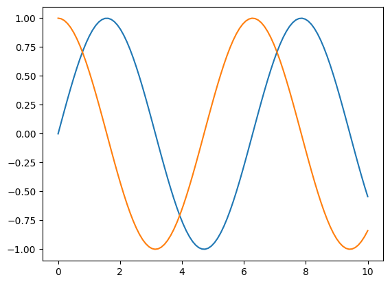
    


```python
# Create a figure with two subplots (vertically stacked)
X = np.linspace(0, 10, 100)
Y1, Y2 = np.sin(X), np.cos(X)
fig, (ax1, ax2) = plt.subplots(2, 1)
ax1.plot(X, Y1, color="C1")
ax2.plot(X, Y2, color="C0")
plt.show()
```


    
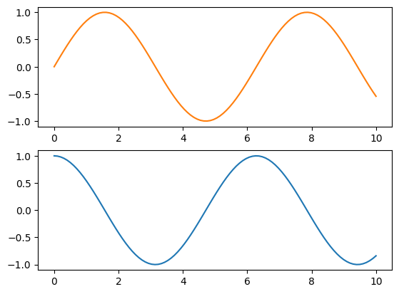
    


```python
# Create a figure with two subplots (horizontally aligned)
X = np.linspace(0, 10, 100)
Y1, Y2 = np.sin(X), np.cos(X)
fig, (ax1, ax2) = plt.subplots(1, 2)
ax1.plot(Y1, X, color="C1")
ax2.plot(Y2, X, color="C0")
plt.show()
```


    

    


## Label


```python
# Create data and plot a sine wave
X = np.linspace(0, 10, 100)
Y = np.sin(X)
plt.plot(X, Y)
plt.show()
```


    
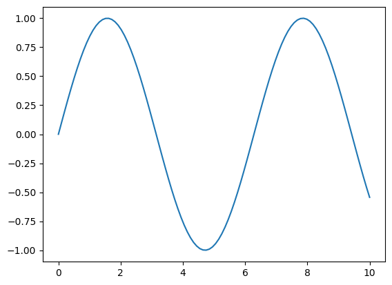
    


```python
# Modify plot properties
X = np.linspace(0, 10, 100)
Y = np.sin(X)
plt.plot(X, Y)
plt.title("A Sine wave")
plt.xlabel("Time")
plt.ylabel(None)
plt.show()
```


    
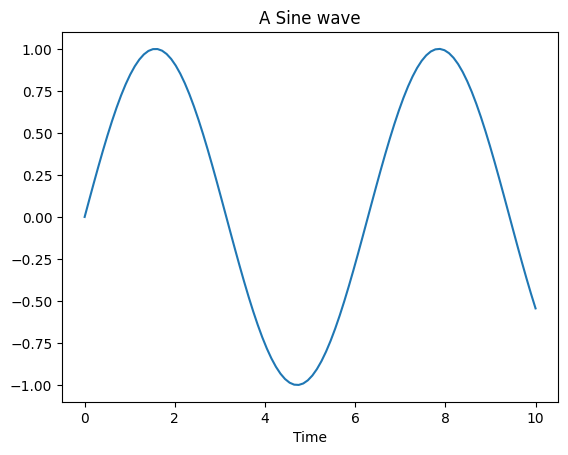
    


## Figure, axes & spines


```python
# Create a 3x3 grid of subplots
fig, axs = plt.subplots(3, 3)

# Set face colors for specific subplots
axs[0, 0].set_facecolor("#ddddff")
axs[2, 2].set_facecolor("#ffffdd")
```


    
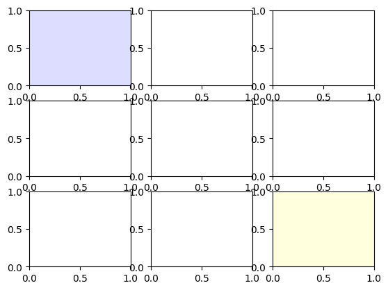
    


```python
# Create a 3x3 grid of subplots
fig, axs = plt.subplots(3, 3)

# Add a grid specification and set face color for a specific subplot
gs = fig.add_gridspec(3, 3)
ax = fig.add_subplot(gs[0, :])
ax.set_facecolor("#ddddff")
```


    
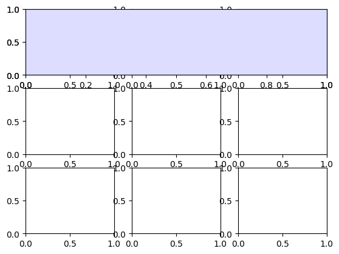
    


```python
# Create a figure with a single subplot
fig, ax = plt.subplots()

# Remove top and right spines from the subplot
ax.spines["top"].set_color("None")
ax.spines["right"].set_color("None")
```


    
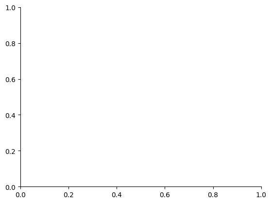
    


## Ticks & labels


```python
# Import the necessary libraries
from matplotlib.ticker import MultipleLocator as ML
from matplotlib.ticker import ScalarFormatter as SF


# Create a figure with a single subplot
fig, ax = plt.subplots()

# Set minor tick locations and formatter for the x-axis
ax.xaxis.set_minor_locator(ML(0.2))
ax.xaxis.set_minor_formatter(SF())

# Rotate minor tick labels on the x-axis
ax.tick_params(axis='x', which='minor', rotation=90)
```


    

    


## Lines & markers


```python
# Generate data and create a plot
X = np.linspace(0.1, 10 * np.pi, 1000)
Y = np.sin(X)
plt.plot(X, Y, "C1o:", markevery=25, mec="1.0")

# Display the plot
plt.show()
```


    
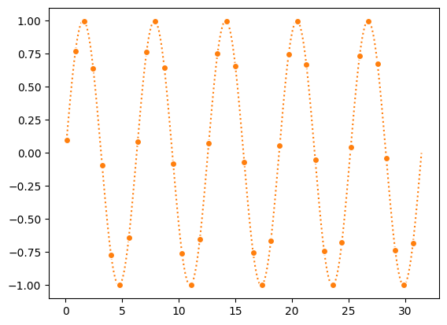
    


## Scales & projections


```python
# Create a figure with a single subplot
fig, ax = plt.subplots()

# Set x-axis scale to logarithmic
ax.set_xscale("log")

# Plot data with specified formatting
ax.plot(X, Y, "C1o-", markevery=25, mec="1.0")

# Display the plot
plt.show()
```


    
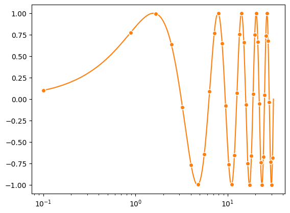
    


## Text & ornaments


```python
# Create a figure with a single subplot
fig, ax = plt.subplots()

# Fill the area between horizontal lines with a curve
ax.fill_betweenx([-1, 1], [0], [2*np.pi])

# Add a text annotation to the plot
ax.text(0, -1, r" Period $\Phi$")

# Display the plot
plt.show()
```


    
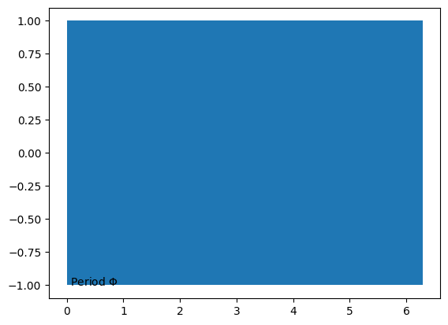
    


## Legend


```python
# Create a figure with a single subplot
fig, ax = plt.subplots()

# Plot sine and cosine curves with specified colors and labels
ax.plot(X, np.sin(X), "C0", label="Sine")
ax.plot(X, np.cos(X), "C1", label="Cosine")

# Add a legend with customized positioning and formatting
ax.legend(bbox_to_anchor=(0, 1, 1, 0.1), ncol=2, mode="expand", loc="lower left")

# Display the plot
plt.show()
```


    
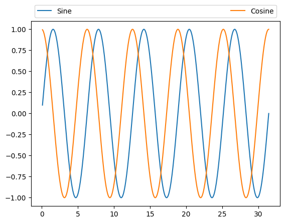
    


## Annotation


```python
# Create a figure with a single subplot
fig, ax = plt.subplots()

ax.plot(X, Y, "C1o:", markevery=25, mec="1.0")

# Add an annotation "A" with an arrow
ax.annotate("A", (X[250], Y[250]), (X[250], -1),
            ha="center", va="center",
            arrowprops={"arrowstyle": "->", "color": "C1"})

# Display the plot
plt.show()
```


    
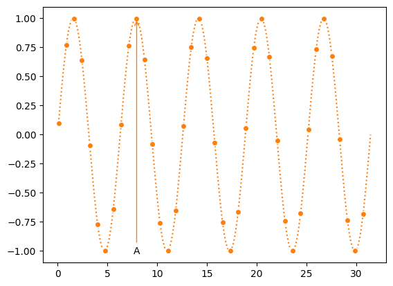
    


## Colors


```python
import math

from matplotlib.patches import Rectangle
import matplotlib.pyplot as plt
import matplotlib.colors as mcolors


def plot_colortable(colors, *, ncols=4, sort_colors=True):

    cell_width = 212
    cell_height = 22
    swatch_width = 48
    margin = 12

    # Sort colors by hue, saturation, value and name.
    if sort_colors is True:
        names = sorted(
            colors, key=lambda c: tuple(mcolors.rgb_to_hsv(mcolors.to_rgb(c))))
    else:
        names = list(colors)

    n = len(names)
    nrows = math.ceil(n / ncols)

    width = cell_width * 4 + 2 * margin
    height = cell_height * nrows + 2 * margin
    dpi = 72

    fig, ax = plt.subplots(figsize=(width / dpi, height / dpi), dpi=dpi)
    fig.subplots_adjust(margin/width, margin/height,
                        (width-margin)/width, (height-margin)/height)
    ax.set_xlim(0, cell_width * 4)
    ax.set_ylim(cell_height * (nrows-0.5), -cell_height/2.)
    ax.yaxis.set_visible(False)
    ax.xaxis.set_visible(False)
    ax.set_axis_off()

    for i, name in enumerate(names):
        row = i % nrows
        col = i // nrows
        y = row * cell_height

        swatch_start_x = cell_width * col
        text_pos_x = cell_width * col + swatch_width + 7

        ax.text(text_pos_x, y, name, fontsize=14,
                horizontalalignment='left',
                verticalalignment='center')

        ax.add_patch(
            Rectangle(xy=(swatch_start_x, y-9), width=swatch_width,
                      height=18, facecolor=colors[name], edgecolor='0.7')
        )

    return fig
```


```python
# CSS Colors
plot_colortable(mcolors.CSS4_COLORS)
plt.show()
```


    
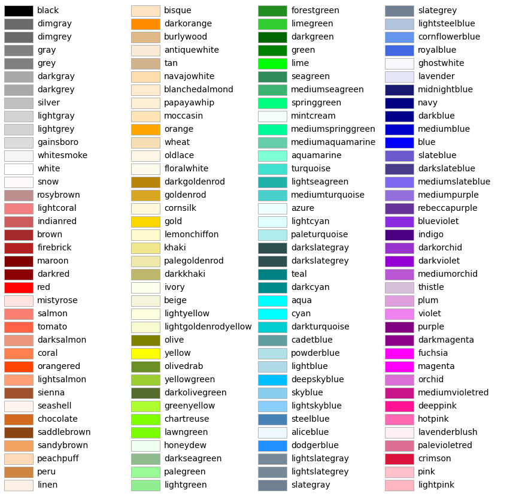
    


```python
# Get a list of named colors
named_colors = plt.colormaps()  
print("Colors:",named_colors)
```

    Colors: ['magma', 'inferno', 'plasma', 'viridis', 'cividis', 'twilight', 'twilight_shifted', 'turbo', 'Blues', 'BrBG', 'BuGn', 'BuPu', 'CMRmap', 'GnBu', 'Greens', 'Greys', 'OrRd', 'Oranges', 'PRGn', 'PiYG', 'PuBu', 'PuBuGn', 'PuOr', 'PuRd', 'Purples', 'RdBu', 'RdGy', 'RdPu', 'RdYlBu', 'RdYlGn', 'Reds', 'Spectral', 'Wistia', 'YlGn', 'YlGnBu', 'YlOrBr', 'YlOrRd', 'afmhot', 'autumn', 'binary', 'bone', 'brg', 'bwr', 'cool', 'coolwarm', 'copper', 'cubehelix', 'flag', 'gist_earth', 'gist_gray', 'gist_heat', 'gist_ncar', 'gist_rainbow', 'gist_stern', 'gist_yarg', 'gnuplot', 'gnuplot2', 'gray', 'hot', 'hsv', 'jet', 'nipy_spectral', 'ocean', 'pink', 'prism', 'rainbow', 'seismic', 'spring', 'summer', 'terrain', 'winter', 'Accent', 'Dark2', 'Paired', 'Pastel1', 'Pastel2', 'Set1', 'Set2', 'Set3', 'tab10', 'tab20', 'tab20b', 'tab20c', 'magma_r', 'inferno_r', 'plasma_r', 'viridis_r', 'cividis_r', 'twilight_r', 'twilight_shifted_r', 'turbo_r', 'Blues_r', 'BrBG_r', 'BuGn_r', 'BuPu_r', 'CMRmap_r', 'GnBu_r', 'Greens_r', 'Greys_r', 'OrRd_r', 'Oranges_r', 'PRGn_r', 'PiYG_r', 'PuBu_r', 'PuBuGn_r', 'PuOr_r', 'PuRd_r', 'Purples_r', 'RdBu_r', 'RdGy_r', 'RdPu_r', 'RdYlBu_r', 'RdYlGn_r', 'Reds_r', 'Spectral_r', 'Wistia_r', 'YlGn_r', 'YlGnBu_r', 'YlOrBr_r', 'YlOrRd_r', 'afmhot_r', 'autumn_r', 'binary_r', 'bone_r', 'brg_r', 'bwr_r', 'cool_r', 'coolwarm_r', 'copper_r', 'cubehelix_r', 'flag_r', 'gist_earth_r', 'gist_gray_r', 'gist_heat_r', 'gist_ncar_r', 'gist_rainbow_r', 'gist_stern_r', 'gist_yarg_r', 'gnuplot_r', 'gnuplot2_r', 'gray_r', 'hot_r', 'hsv_r', 'jet_r', 'nipy_spectral_r', 'ocean_r', 'pink_r', 'prism_r', 'rainbow_r', 'seismic_r', 'spring_r', 'summer_r', 'terrain_r', 'winter_r', 'Accent_r', 'Dark2_r', 'Paired_r', 'Pastel1_r', 'Pastel2_r', 'Set1_r', 'Set2_r', 'Set3_r', 'tab10_r', 'tab20_r', 'tab20b_r', 'tab20c_r']
    

## Save

```python
# Save the figure as a PNG file with higher resolution (300 dpi)
fig.savefig("my-first-figure.png", dpi=300)

# Save the figure as a PDF file
fig.savefig("my-first-figure.pdf")
```
