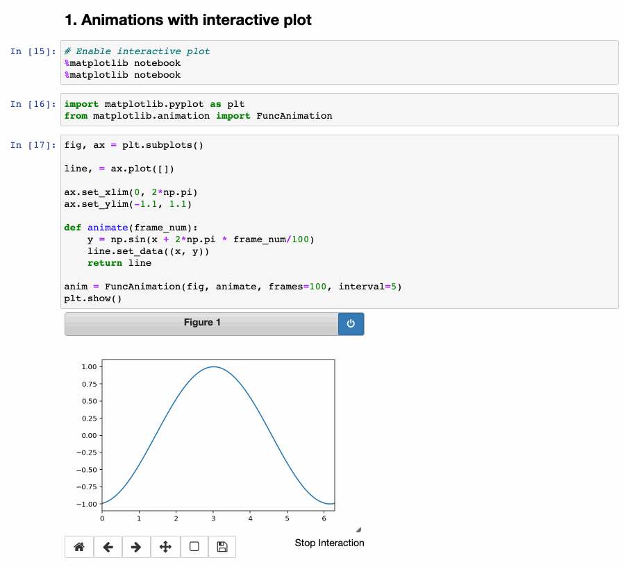
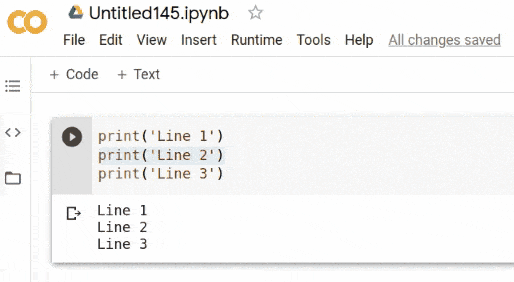

# Cheat Sheets for Data Science Learning

This repository serves as a hub for various Cheat Sheets related to 
the field of Data Science (with Python). What sets these Cheat Sheets apart is their 
multi-dimensional approach to enhancing the learning experience. 
Each Cheat Sheet is made available in three distinct formats: **PDF**, **Streamlit**, and **Google Colab**.

This triad of accessibility ensures that learners can engage with the content in 
a way that suits their preferences and learning style.

**Content**

| Topic         | PDF                                                                                                                                                                                                                                  | Streamlit                                                                                                                                                                                                  | Google Colab                                                                                                                                                                                                                                   |
|---------------|--------------------------------------------------------------------------------------------------------------------------------------------------------------------------------------------------------------------------------------|------------------------------------------------------------------------------------------------------------------------------------------------------------------------------------------------------------|------------------------------------------------------------------------------------------------------------------------------------------------------------------------------------------------------------------------------------------------|
| python        |        |   |          |
| numpy         |         |   |            |
| pandas        |        |   |          |
| matplotlib    |    |   |  |
| scikit-learn  |  |   |   |

> **Note**: The PDF format cheat sheets included here are authored by other contributors and have been used as sources of inspiration for the content presented.

## More Information

### What is a Cheat Sheet ?

A cheat sheet is a concise and informative reference guide that provides
quick and easy access to essential information or instructions about a specific topic.

It's designed to help individuals quickly understand key concepts, commands, formulas,
or procedures without having to search through lengthy documentation or resources. 
Cheat sheets are often used as handy reference tools for tasks that require familiarity 
with specific details or steps, such as programming languages, software applications, 
or academic subjects. They serve as a valuable aid for both beginners and experienced
practitioners by condensing important information into a single, easily digestible format.

### What is Streamlit ?

[Streamlit](https://streamlit.io/) is an open-source Python library that simplifies and accelerates the
process of creating interactive web applications for data science and machine learning projects.
It allows developers, data scientists, and researchers to transform data scripts into shareable 
web applications quickly and with minimal effort.

### What is Jupyter Notebook ?

[Jupyter Notebook](https://jupyter.org/) is an open-source web application that provides 
an interactive and flexible environment for creating, sharing, and executing documents that contain live code, equations, visualizations, and explanatory text. It's widely used by researchers, data scientists, educators, and professionals 
to develop and present code-based projects, analyses, and reports.

### What is Google Colab ?

[Google Colab](https://colab.research.google.com/), short for Google Colaboratory, is a cloud-based,
interactive development environment provided by Google
that enables users to write, execute, and share Python code in a 
collaborative and convenient manner. It's particularly popular among researchers, 
data scientists, and educators for its ease of use and the fact that it doesn't 
require any setup or installation.

## References

* [Data Science Cheat Sheets - DataCamp](https://www.datacamp.com/cheat-sheet)
* [Cheatsheets and Handouts - Matplotlib](https://matplotlib.org/cheatsheets/)
* [Streamlit Cheat Sheet - Daniel Lewis](https://github.com/daniellewisDL/streamlit-cheat-sheet)

